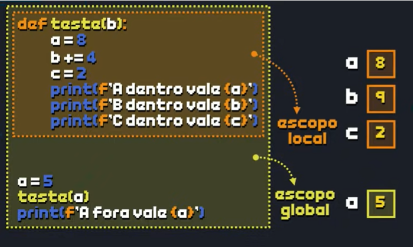

# Fuções 02:
- Nessa aula, vamos continuar nossos estudos de funções em Python, aprendendo mais sobre Interactive Help em Python, o uso de docstrings para documentar nossas funções, argumentos opcionais para dar mais dinamismo em funções Python, escopo de variáveis e retorno de resultados.

## Interacive Heap:
- O comando `help` fornece informações detalhadas sobre outros comandos, módulos, classes, métodos e objetos em Python.
### Como Usar
#### 1. `help()` sem argumentos
```python
help()
```
#### 2. `help(objecto ou comando)`
Usando `help()` com um argumento, você obtém a documentação desse comando ou objeto específico.
**Exemplo com uma função**:
```python
help(print)
```

**Exemplo com um módulo**:
```python
import math
help(math)
```

### Impressão Doc
- **Impressão da docstring de uma função ou método específico**:
   Quando uma função tem uma docstring, podemos imprimir essa documentação para entender o que ela faz e como usá-la.

+ Exemplo:
   ```python
   print(input.__doc__)
   ```

-  **Aplicação prática**:
   Ao imprimir `__doc__`, o desenvolvedor pode consultar rapidamente o propósito e a forma de usar uma função sem precisar buscar em documentação externa, o que economiza tempo e facilita a codificação.

### Docstrings

- Docstrings são uma prática de documentação em Python e servem para descrever o que uma função, método, classe ou módulo faz. Elas são declaradas usando aspas triplas `"""` logo após a definição do código. 

+ **Estrutura das Docstrings**:
   Docstrings são strings de várias linhas que podem incluir:
   - Uma descrição breve da funcionalidade.
   - Uma lista de parâmetros com seus tipos e propósitos.
   - Uma seção de retorno, explicando o tipo de dado retornado e seu significado.

   Exemplo de docstring para uma função:
   ```python
   def soma(a, b):
       """
       Calcula a soma de dois números.

       Parâmetros:
       a (int, float): O primeiro número a ser somado.
       b (int, float): O segundo número a ser somado.

       Retorna:
       int, float: O resultado da soma entre 'a' e 'b'.
       """
       return a + b
   ```

- Acessar docstrings é fácil: em qualquer função ou método documentado, basta usar `print(funcao.__doc__)` para exibir a descrição.

### Parâmetro opcional: 
- É um parâmetro de uma função que tem um valor padrão.
+ Para definir um parâmetro opcional, basta atribuir um valor a ele na assinatura da função. 
Exemplo:
```python
def saudacao(nome, saudacao="Olá"):
    print(f"{saudacao}, {nome}!")
```

### Escopo de varíaveis
- Varíavel global (Área completa) e Local(Está em um espaço).
```py
def teste():
    x = 8
    print(f"Na função teste, n vale {n}") # 2
    print(f"Na função teste, x vale {n}") # 8 


# Prgrama principal:
n = 2 # Global
print(f"Na função principal, n vale {n}")
print(f"Na função principal, x vale {x}") # ERRO, x está só em teste.

```



- Se caso colocar a mesma varíavel dentro de uma função, ela ná é sobrescrita e sim é criado outra identica, sendo está local diferente da global.

- Existe também nas bibliotecas. 

- Comando **global** é usado dentro das funções para colocar o valor da variavel com a mesma nomeclatura seja a variavel global. 


### Retorno de valores
- O `return` é usada dentro de uma função para **devolver um valor ao código que chamou a função**.
-  Quando o `return` é executado, ele encerra a execução da função imediatamente e envia de volta o valor especificado. 

```python
def nome_da_funcao(parametros):
    # Operações ou cálculos
    return valor_a_retornar
```

Exemplo simples:
```python
def soma(a, b):
    resultado = a + b
    return resultado
```

```python
resultado = soma(3, 4)  # resultado agora é 7
print(resultado)        # Saída: 7
```

### Funcionamento do `return`
- Assim que `return` é executado, a função é encerrada e não continua a execução do código que vem após ele.
   ```python
   def exemplo():
       print("Início")
       return "Fim"
       print("Esta linha não será executada")

   print(exemplo())  # Saída: "Início" e depois "Fim"
   ```

- Python permite retornar múltiplos valores ao mesmo tempo, usando uma tupla.
   ```python
   def calculos(a, b):
       soma = a + b
       produto = a * b
       return soma, produto

   resultado_soma, resultado_produto = calculos(3, 4)
   print(resultado_soma)   # Saída: 7
   print(resultado_produto) # Saída: 12
   ```
