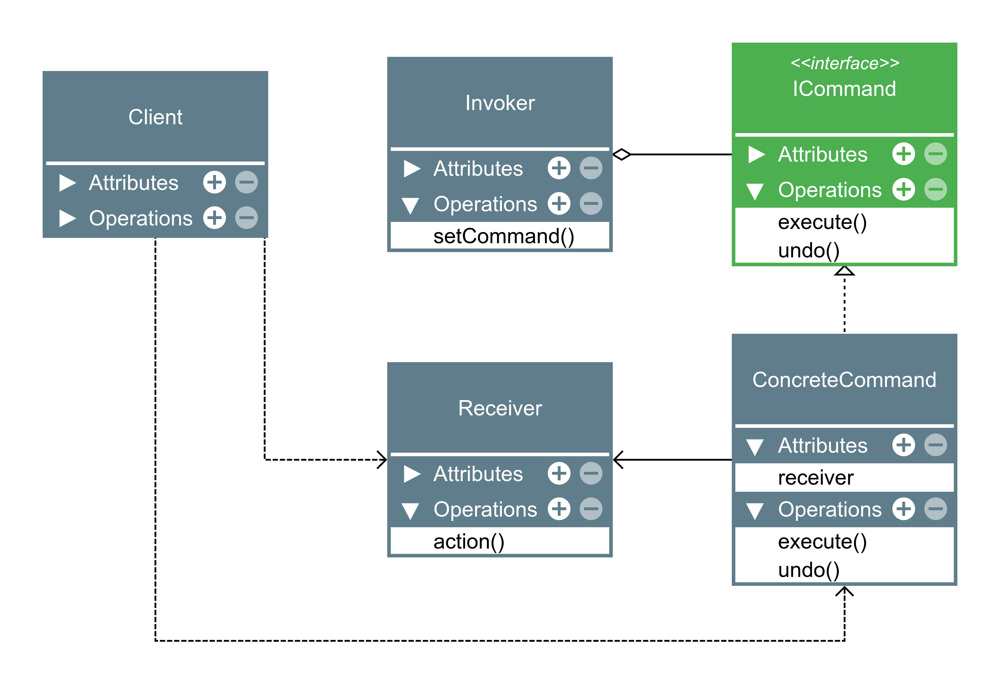

## Command
- Command tem intenção de encapsular uma solicitação como um objeto, desta forma permitindo parametrizar clientes com diferentes solicitações, enfileirar ou fazer registro (log) de solicitações e suportar operações que podem ser desfeitas.

- É formado por um cliente (quem orquestra tudo), um invoker (que invoca as solicitações), um ou vários objetos de comando (que fazem a ligação entre o receiver e a ação a ser executada) e um receiver (o objeto que vai executar a ação no final).

---

---