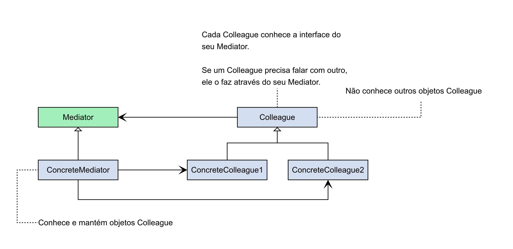

## Mediator
- Mediator é um padrão de projeto comportamental que tem a intenção de definir um objeto que encapsula a forma como um conjunto de objetos interage. O Mediator promove o baixo acoplamento ao evitar que os objetos se refiram uns aos outros explicitamente e permite variar suas interações independentemente.

- Como um chat.

---

---