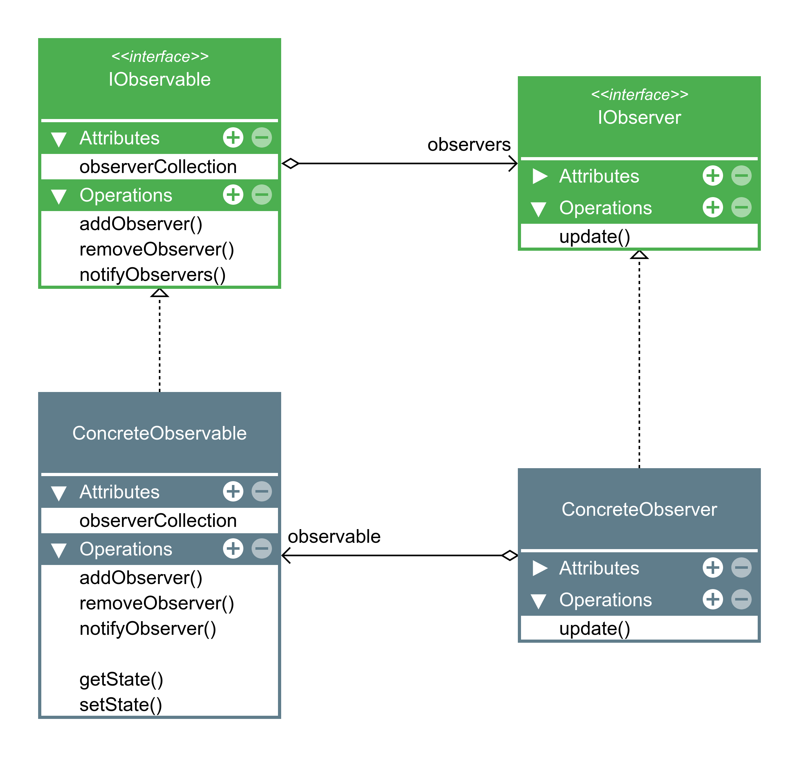

## Observer 
**Definição:**
- O Observer é um padrão de projeto comportamental que permite que você defina um mecanismo de assinatura para notificar múltiplos objetos sobre quaisquer eventos que aconteçam com o objeto que eles estão observando.

- O padrão Observer tem a intenção de definir uma dependência de um-para-muitos entre objetos, de maneira que quando um objeto muda de estado, todo os seus dependentes são notificados e atualizados automaticamente.

- Um observer é um objeto que gostaria de ser informado, um observable (subject) é a entidade que gera as informações.

**Como funciona:**
* O **Sujeito** (Subject) mantém uma lista de inscritos.
* O **Observador** (Observer) se inscreve no Sujeito.
* Quando algo acontece no Sujeito, ele percorre a lista e chama um método de atualização em cada Observador.

**Exemplo Prático:**
* **Newsletter:** O blog é o Sujeito; os leitores são os Observadores. Quando sai um post novo, todos recebem e-mail.
* **Interface Gráfica (Listeners):** O botão é o Sujeito. O código que reage ao clique é o Observador.
* **Youtube:** O canal é o sujeito, os inscritos são os observadores.

**Quando usar:**
* Quando a mudança em um objeto exige mudanças em outros, e você não sabe quantos objetos precisam mudar.
* Para criar sistemas desacoplados (o Sujeito não precisa saber quem são os Observadores nem o que eles fazem).

- Estrutura:
---

---