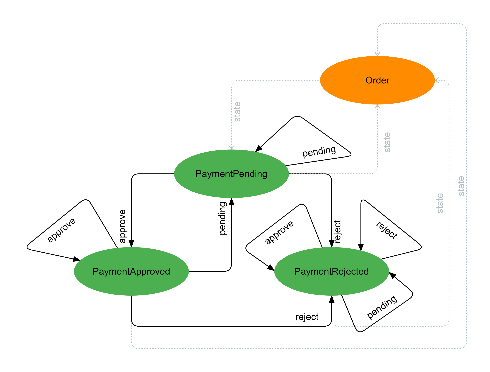
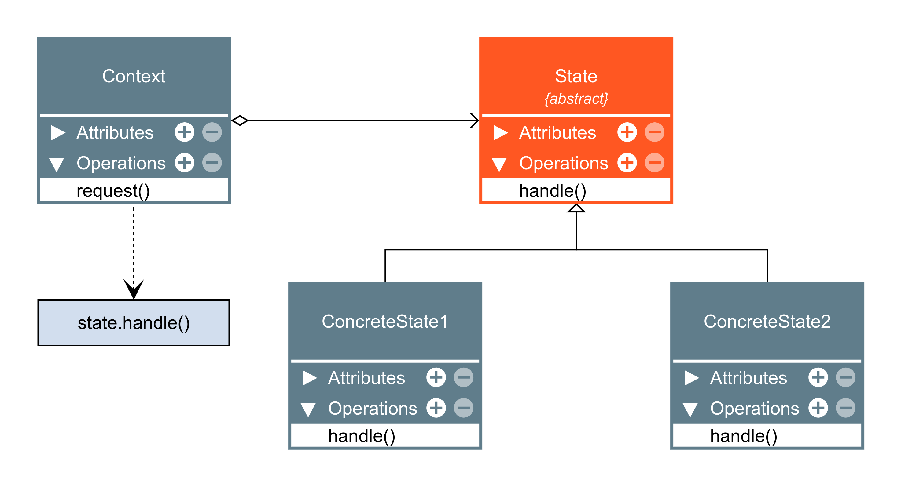

## State 
**Definição:** O State é um padrão de projeto comportamental que permite que um objeto altere seu comportamento quando seu estado interno muda. 

- O Padrão de projeto State é um padrão comportamental que tem a intenção de permitir a um objeto mudar seu comportamento quando o seu estado interno muda.

- O objeto parecerá ter mudado sua classe.

---

- Problema:

- Solução

---

- Context: Pedido.
- State: estado abstrato
- ConcreteState: estados do contexto.