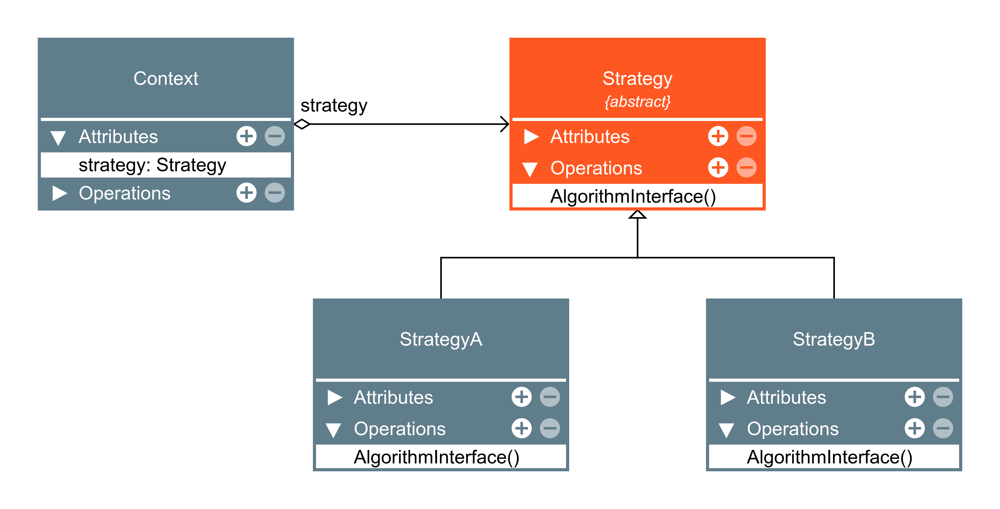

## Strategy 
- Strategy é um padrão de projeto comportamental que tem a intenção de definir uma família de algoritmos, encapsular cada uma delas e torná-las intercambiáveis. Strategy permite que o algorítmo varie independentemente dos clientes que o utilizam.

- Princípio do aberto/fechado (Open/closed principle)
Entidades devem ser abertas para extensão, mas fechadas para modificação

- Estrutura:
---

---