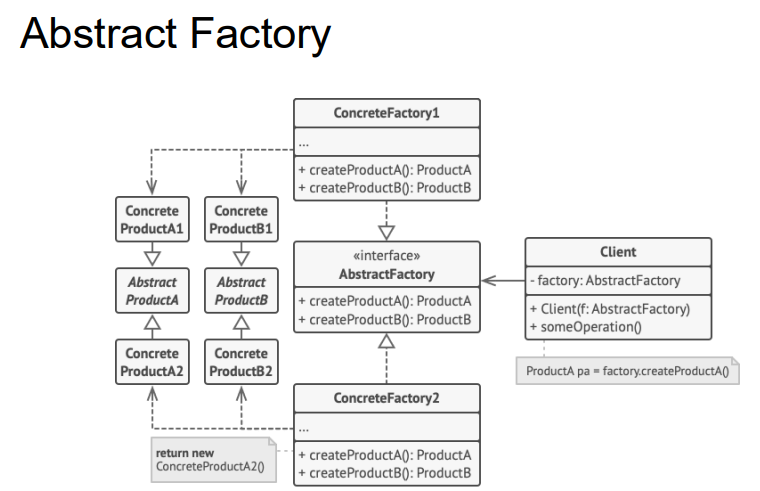
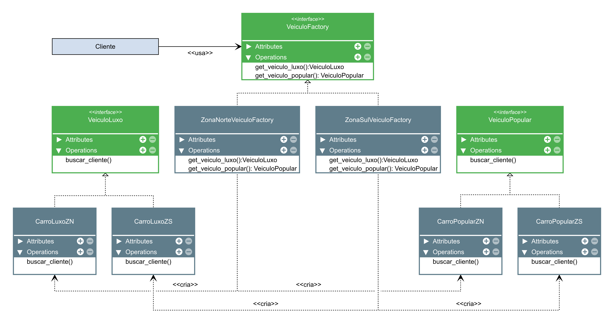

## O Padrão Abstract Factory
- O padrão Abstract Factory fornece uma interface para criar famílias de objetos relacionados ou dependentes sem especificar suas classes concretas.
- Abstract Factory: cria famílias de objs.
- O método fábrica é responsável por instanciar as classes desejadas.
- Composto por factory methods.
- Sepapara o codigo de criação do codigo que usa os objs.

- Abstract Factory é um padrão de criação que fornece uma interface para criar
famílias de objetos relacionados ou dependentes sem especificar suas classes
concretas. Geralmente Abstract Factory conta com um ou mais Factory Methods
para criar seus objetos.

- Uma diferença importante entre Factory Method e Abstract Factory é que o
Factory Method usa herança, enquanto Abstract Factory usa a composição.

- Princípio: programe para interfaces, não para implementações

- Estrutra a seguir.
---

---

- ConcreteFactory: Implementa a interface AbstractFactory, criando objetos concretos.
- AbstractFactory: Declara uma interface para criar objetos abstratos.
- Client: Usa apenas interfaces declaradas pelas AbstractFactory e AbstractProduct classes.

- Definição resumida de abstract factory é "fábrica de fábricas".
