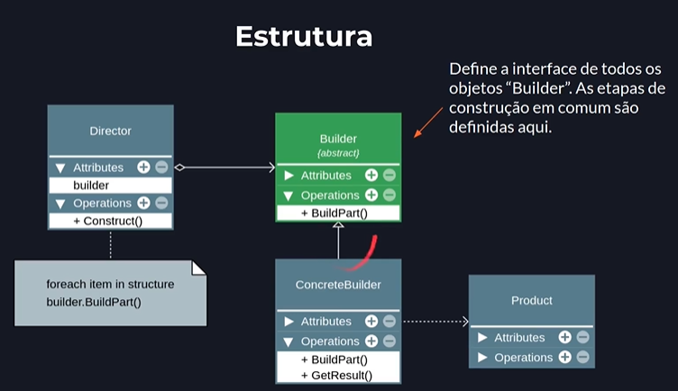

## O padrão Builder
- O padrão Builder separa a construção de um objeto complexo da sua representação, permitindo que o mesmo processo de construção crie diferentes representações.
- Builder: constrói um objeto complexo passo a passo.
- Sepapara o codigo de criação do codigo que usa os objs.
- Pense nele como encomendar um computador personalizado online. Em vez de ter um único construtor com uma lista enorme e confusa de parâmetros, você segue um processo passo a passo:

> Primeiro, você escolhe o processador.

> Depois, escolhe a memória RAM.

> Em seguida, escolhe o armazenamento.

> Por fim, clica em "Montar Computador".

---

---
Builder: Declara os passos para construir o produto.

Director: Define a ordem de construção usando o Builder.

ConcreteBuilder: Implementa os passos para construir o produto específico.

Product: O objeto complexo que está sendo construído.
