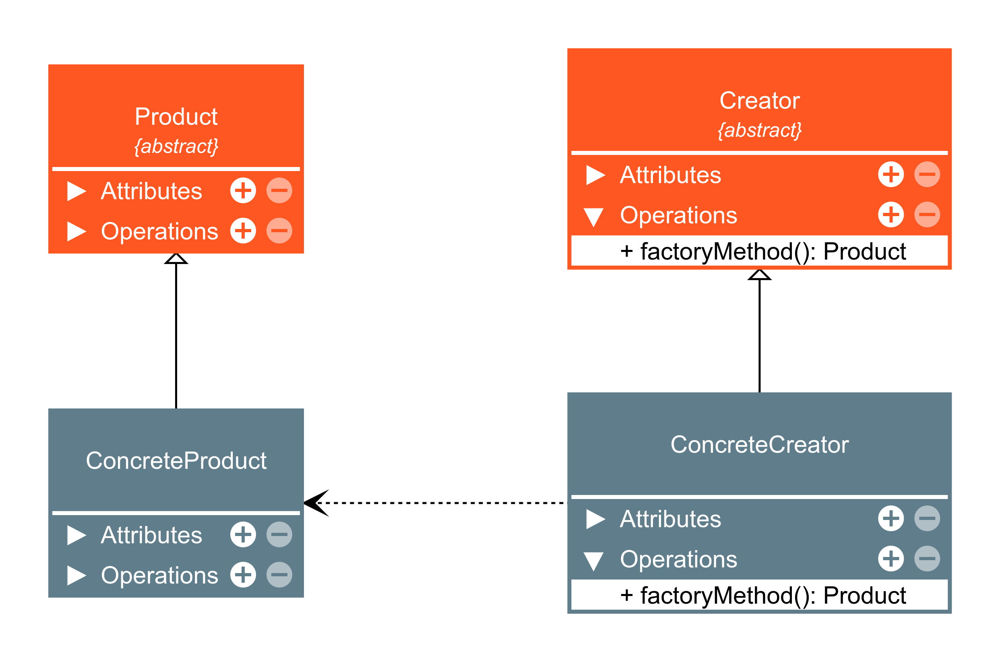
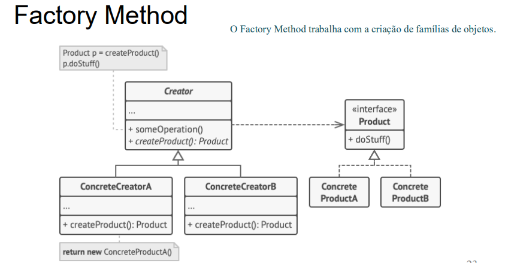
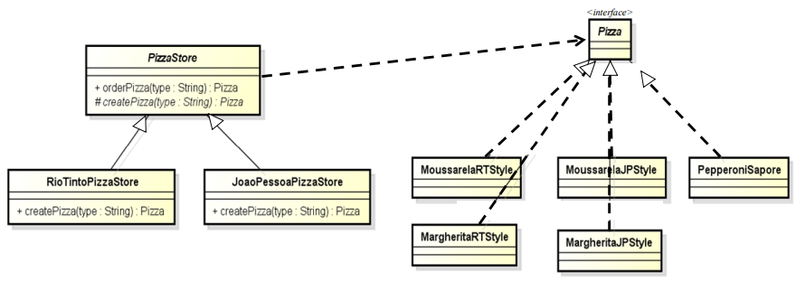

##### O Padrão Factory Method
- O padrão Factory Method define uma interface para criar um objeto, mas permite às classes decidir qual classe instanciar. O Factory Method permite adiar a instanciação para subclasses.

- Factory method é um padrão de criação que permite definir uma interface para criar objetos, mas deixa as subclasses decidirem quais objetos criar. OnFactory method permite adiar a instanciação para as subclasses, garantindo o baixo acoplamento entre classes.

- Factory: cria um obj.
- O método fábrica é responsável por instanciar as classes desejadas.
- Obtido por herança.

- Estrutra a seguir.

---

- ConcreteProduct: retorna a interface Product.
- Creator: Declara o factory method, que retorna um objeto do tipo Product. Pode também definir uma implementação padrão do factory method que retorna um objeto de uma classe ConcreteProduct padrão.

---

---