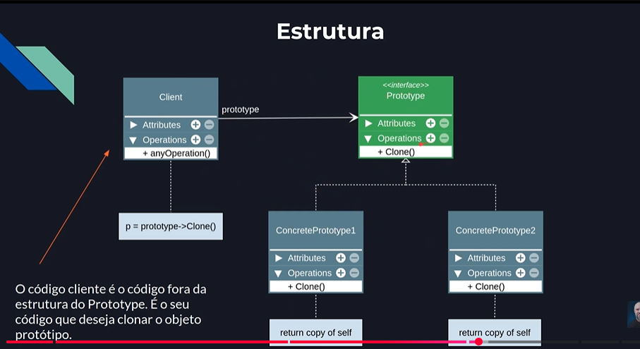

##### O Padrão Prototype
- O padrão Prototype especifica os tipos de objetos a serem criados usando uma instância prototípica e cria novos objetos copiando esse protótipo.
- Prototype: declara uma interface para clonar a si mesmo.
- Permite criar novos objetos pela cópia de um objeto existente (protótipo).

- Especificar os tipos de objetos a serem criados usando uma instância-protótipo e criar novos objetos pela cópia desse protótipo.

---

---