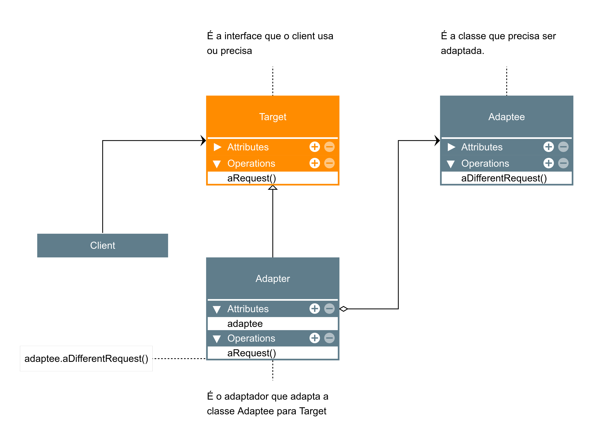

## Adapter 
**Definição:**
Permite que classes com interfaces incompatíveis trabalhem juntas através de um adaptador. Ele atua como um tradutor entre dois objetos que, de outra forma, não conseguiriam se comunicar.

**Como funciona:**
* O **Adapter** implementa a interface que o cliente espera.
* Dentro dele, ele chama os métodos do objeto incompatível (Adaptee), convertendo os dados se necessário.

**Exemplo:**
* **Sistemas Legados:** Seu sistema espera dados em formato `JSON`, mas precisa consumir uma API antiga de um banco que retorna `XML`. Você cria um Adapter que recebe XML, converte e entrega JSON para seu sistema.

**Quando usar:**
* Quando você quer usar uma classe existente, mas sua interface não corresponde à que você precisa.
* Para integrar bibliotecas de terceiros ou sistemas legados sem alterar o código original deles.

---

---