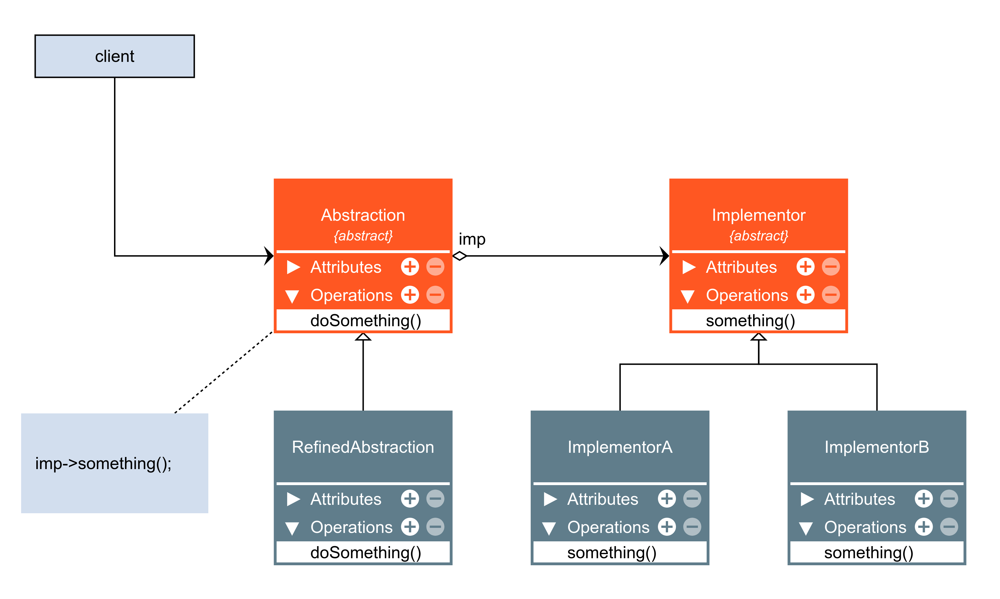

## Bridge
- Bridge é um padrão de projeto estrutural que tem a intenção de desacoplar uma abstração
da sua implementação, de modo que as duas possam variar e evoluir independentemente.

- Abstração é uma camada de alto nível para algo. Geralmente, a abstração não faz nenhum trabalho
por conta própria, ela delega parte ou todo o trabalho para a camada de implementação.

RELEMBRANDO: Adapter é um padrão de projeto estrutural que tem a intenção de permitir
que duas classes que seriam incompatíveis trabalhem em conjunto através de um "adaptador".

Diferença (GOF pag. 208) - A diferença chave entre esses padrões está nas suas intenções...
...O padrão Adapter faz as coisas funcionarem APÓS elas terem sido projetadas; o Bridge as
faz funcionar ANTES QUE existam...

---

---