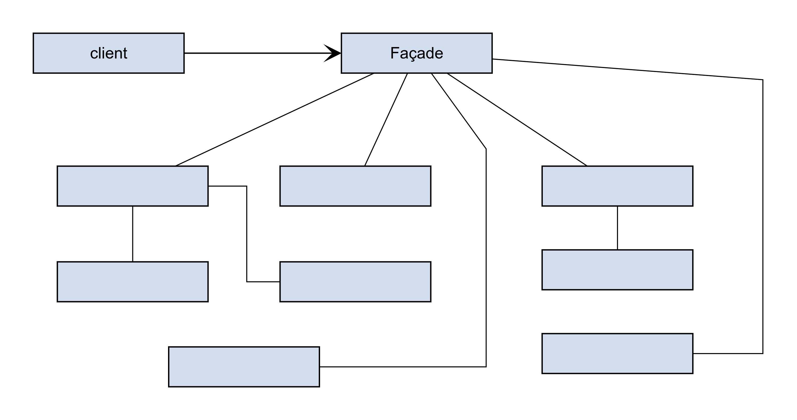
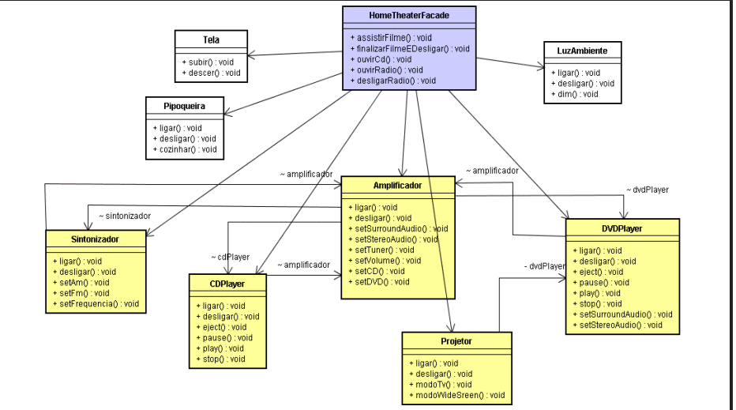

## Facade
**Definição:**
Fornece uma interface simplificada unificada (uma "fachada") para um subsistema complexo contendo muitas classes e partes móveis.

- Fornecer uma interface unificada para um conjunto de interfaces em um subsistema. Façade define uma interface de nível mais alto que torna o subsistema mais fácil de ser usado.

**Como funciona:**
* A classe **Facade** conhece quais classes do subsistema são responsáveis por uma solicitação e delega as chamadas para os objetos apropriados.
* O cliente interage apenas com a Facade, sem precisar conhecer a complexidade interna.

**Exemplo Prático:**
* **Ligar Computador:** Ao apertar o botão "Ligar" (Facade), o sistema internamente: verifica a energia -> inicia a CPU -> carrega a memória -> monta o disco -> inicia o SO. O usuário só apertou um botão.
* **E-commerce:** Um método `finalizarCompra()` na Facade pode, internamente, chamar o `ServicoDeEstoque`, `ServicoDePagamento`, `ServicoDeNotaFiscal` e `ServicoDeEnvio`.

**Quando usar:**
* Para oferecer uma interface simples para uma biblioteca complexa.
* Para desacoplar seu código de subsistemas complexos (se o subsistema mudar, você só altera a Facade, não o código todo).

---

---