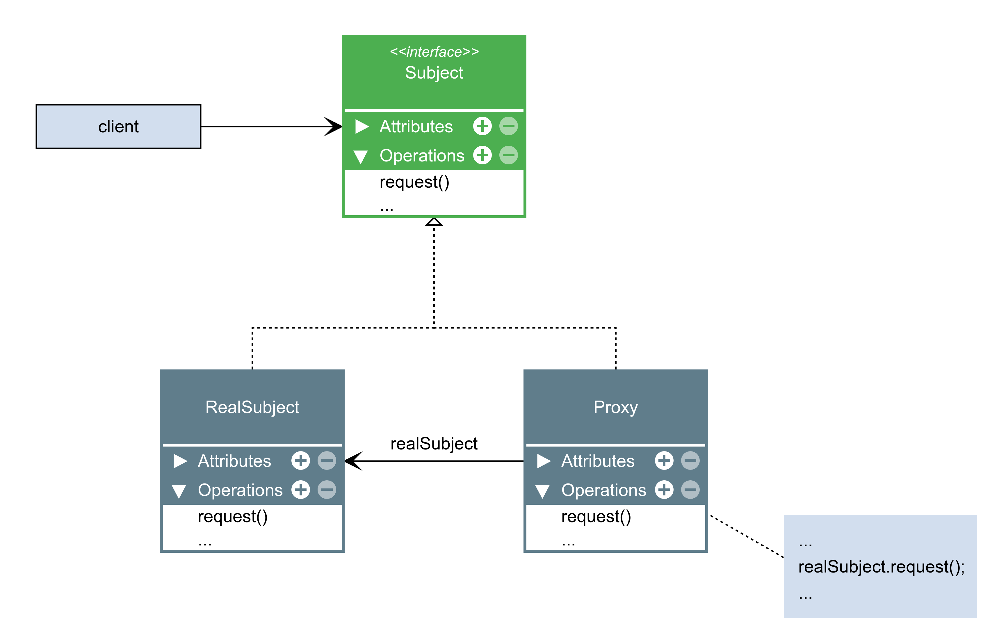

## Proxy
- O Proxy é um padrão de projeto estrutural que tem a
intenção de fornecer um objeto substituto que atua
como se fosse o objeto real que o código cliente
gostaria de usar.

- O proxy receberá as solicitações e terá controle
sobre como e quando repassar tais solicitações ao
objeto real.

- Com base no modo como o proxies são usados,
nós os classificamos como:

- Aceleração das solicitações.
- **Imitação/substito**.

- **Proxy Virtual**: controla acesso a recursos que podem
ser caros para criação ou utilização.
- Proxy Remoto: controla acesso a recursos que estão
em servidores remotos.
- Proxy de proteção: controla acesso a recursos que
possam necessitar autenticação ou permissão.
- **Proxy inteligente**: além de controlar acesso ao
objeto real, também executa tarefas adicionais para
saber quando e como executar determinadas ações.

Proxies podem fazer várias coisas diferentes:
criar logs, autenticar usuários, distribuir serviços,
criar cache, criar e destruir objetos, adiar execuções
e muito mais...

---

---