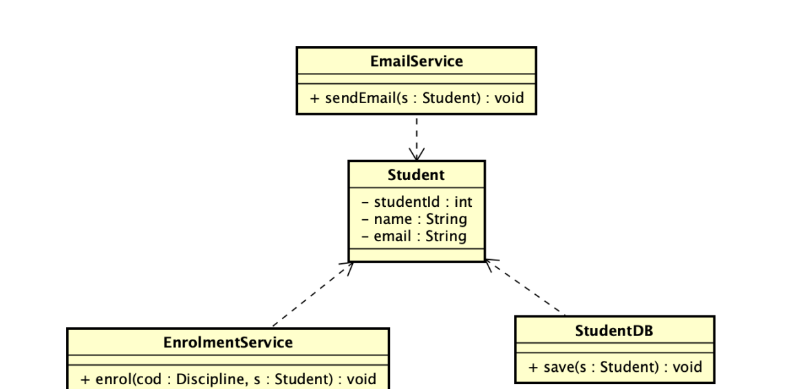
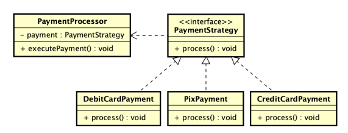
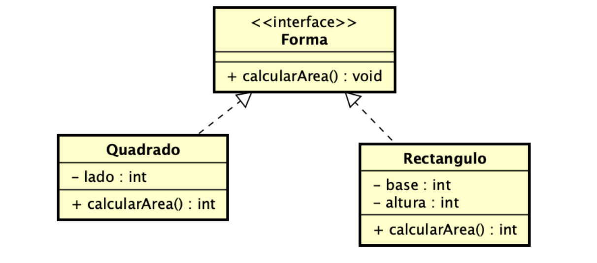

## Principios SOLID
- Princípios a serem aplicados em projetos orientados a objetos de forma a criar softwares “sólidos” - fáceis de criar, manter, estender e refatorar.

### **Single Responsibility Principle** (Princípio da Responsabilidade Única)
- Uma classe deve ter apenas um motivo para mudar, ou seja, deve ter apenas uma única responsabilidade.
- Se uma classe tem muitas responsabilidades divida a-a em classes menores, cada uma com uma responsabilidade única. 

- Dividimos em gerenciadores funcionais.

> Antes a classe estudante estava cheia de metodos e agora fragmentado e otimizado. 
---


---


### **Open-Close Principle** (Princípio do Aberto/Fechado)
- Uma classe deve estar aberta para extensão, mas fechada para modificação.
- Isso significa que devemos ser capazes de adicionar novos comportamentos a uma classe sem alterar seu código-fonte existente, geralmente através de herança ou composição.
- Evitar modificações na classe original.

---


---

| Conceito do Princípio | Componente no Diagrama | Explicação |
|---|---|---|
| Fechado para Modificação | PaymentProcessor | A classe principal que orquestra a ação. Seu código nunca muda, não importa quantas novas formas de pagamento surjam. |
| Aberto para Extensão | Interface PaymentStrategy e suas implementações | É a "porta" para novas funcionalidades. Para adicionar um novo comportamento, basta criar uma nova classe que implemente esta interface. |
| As "Extensões" | DebitCardPayment, PixPayment, CreditCardPayment e futuras classes | São as novas funcionalidades que podemos adicionar infinitamente sem quebrar o que já existe. |


### **Liskov Substitution Principle** (Princípio de Substituição de Liskov)
- Objetos de uma classe derivada devem poder substituir objetos da classe base sem alterar as propriedades desejáveis do programa (correção, desempenho, etc.).
- De forma clara: uma subclasse deve ser substituível por sua superclasse.
- Isso significa que uma classe filha (subclasse) deve poder substituir sua classe mãe (superclasse) sem quebrar o código.
 
---


---


### **Interfaces Segregation Principle** (Princípio da Segregação de Interfaces)
- É melhor ter várias interfaces pequenas e coesas do que uma interface grande com métodos que algumas classes não precisam.
- É uma forma de fragmentar em interfaces. 

### **Dependency Inversion Principle** (Princípio da Inversão de Dependência)
- Módulos de alto e baixo nível devem depender de abstrações.
- O DIP fala sobre como as classes se relacionam entre si.

> Classes de alto nível → são as que contêm a lógica principal do sistema (ex: regras de negócio).

> Classes de baixo nível → são as que executam tarefas específicas, como acessar banco de dados, enviar e-mail, ler arquivo etc.

- O erro comum é o módulo de alto nível depender diretamente de um módulo de baixo nível.

> Aplicando o DIP corretamente

- Criamos uma abstração (interface) para o banco de dados.
- Fazemos as implementações concretas dependerem dela.
- A classe de alto nível também depende da abstração, não da implementação.


* Em vez de uma classe depender diretamente de outra classe concreta, ela deve depender de uma **interface** ou **abstração**.
* Isso **reduz o acoplamento** e **aumenta a flexibilidade** do sistema.

### Exemplo simples:

Sem aplicar o princípio:

```java
class Lampada {
    void ligar() { System.out.println("Lâmpada ligada"); }
}

class Interruptor {
    private Lampada lampada;
    Interruptor(Lampada lampada) { this.lampada = lampada; }
    void acionar() { lampada.ligar(); }
}
```

O `Interruptor` depende diretamente de uma `Lampada`.

Aplicando o **Dependency Inversion**:

```java
interface Dispositivo {
    void ligar();
}

class Lampada implements Dispositivo {
    public void ligar() { System.out.println("Lâmpada ligada"); }
}

class Interruptor {
    private Dispositivo dispositivo;
    Interruptor(Dispositivo dispositivo) { this.dispositivo = dispositivo; }
    void acionar() { dispositivo.ligar(); }
}
```

Agora, o `Interruptor` não depende mais de uma implementação concreta, e sim de uma abstração (`Dispositivo`).
Assim, é possível conectar qualquer dispositivo (ventilador, TV, etc.) sem alterar o código do `Interruptor`.
