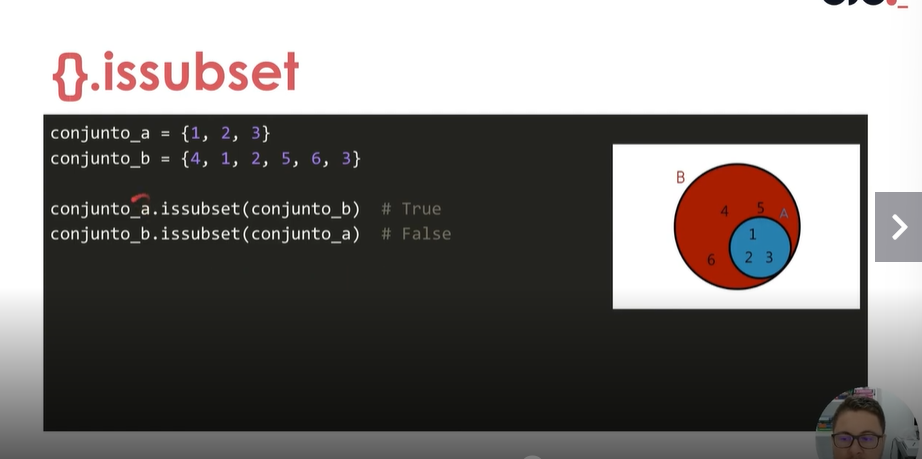

## Operadores importantes para o tipo set (conjuntos)
## União (`|` ou `union()`) - Une
- A união de dois conjuntos retorna um novo conjunto contendo todos os elementos de ambos, **sem duplicatas**.  
- Sintaxe
```python
A | B
A.union(B)
```
- Exemplo 
```python
A = {1, 2, 3}
B = {3, 4, 5}

print(A | B)         # Saída: {1, 2, 3, 4, 5}
print(A.union(B))    # Saída: {1, 2, 3, 4, 5}
```

##  Interseção (`&` ou `intersection()`) - Itens presentes em ambos
- A interseção de dois conjuntos retorna um novo conjunto contendo **apenas os elementos comuns** entre os dois.  
- Sintaxe
```python
A & B
A.intersection(B)
```
- Exemplo 
```python
A = {1, 2, 3}
B = {3, 4, 5}

print(A & B)             # Saída: {3}
print(A.intersection(B)) # Saída: {3}
```

## Diferença (`-` ou `difference()`) - Itens presentes apenas no set da esquerda
 
- A diferença entre dois conjuntos retorna um novo conjunto contendo **apenas os elementos que estão no primeiro conjunto (`A`), mas não no segundo (`B`)**.  
- **A Ordem Importa !**

- Sintaxe
```python
A - B
A.difference(B)
```

- Exemplo 
```python
A = {1, 2, 3}
B = {3, 4, 5}

print(A - B)           # Saída: {1, 2}
print(A.difference(B)) # Saída: {1, 2}
```

## Diferença Simétrica (`^` ou `symmetric_difference()`) - Itens que não estão em ambos
- A diferença simétrica entre dois conjuntos retorna um novo conjunto contendo **os elementos que estão em um dos conjuntos, mas não em ambos**.  

- Sintaxe
```python
A ^ B
A.symmetric_difference(B)
```

- Exemplo 
```python
A = {1, 2, 3}
B = {3, 4, 5}

print(A ^ B)                       # Saída: {1, 2, 4, 5}
print(A.symmetric_difference(B))   # Saída: {1, 2, 4, 5}
```


## Resumo
```py
sep_01 = {1, 2, 3}
sep_02 = {2, 3, 4}

sep_03_operacao = sep_01 | sep_02
print(sep_03_operacao)
sep_03_operacao = sep_01 & sep_02
print(sep_03_operacao)
sep_03_operacao = sep_02 - sep_01
print(sep_03_operacao)
sep_03_operacao = sep_01 ^ sep_02
print(sep_03_operacao)
```

### Outros:
---

- Elementods de A que estão em B
- Issuperset é o oposto.
- isdisjoint -> Dois conjuntos distintos
- copy()
- discard(element)
- pop() remover o primeiro elemento
- len()
- 
---